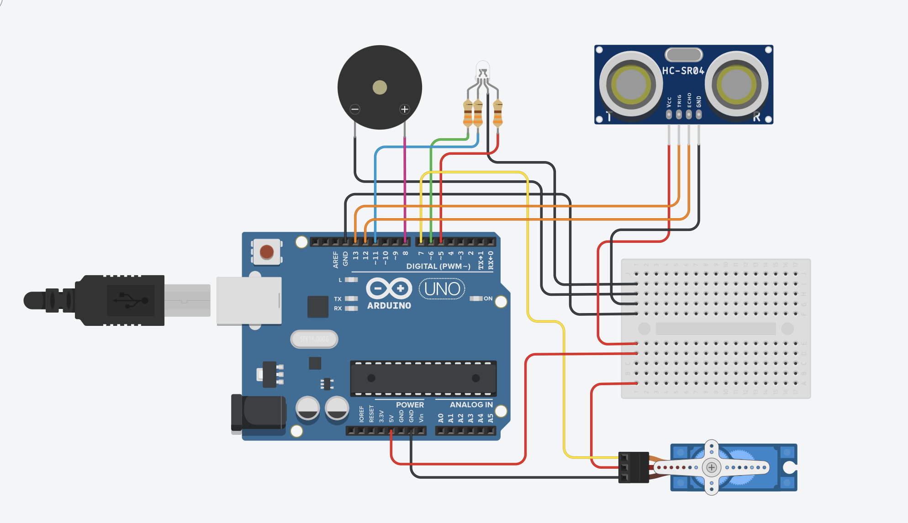

# Arduino Sonar System & Radar GUI

An integrated sonar mapping system that uses an **HC-SR04 Ultrasonic sensor** mounted on an **SG90 Servo motor**. This project features a custom built Processing GUI to visualize the radar sweeps in real time

## Key Features
* **Distance Detection:** Measurement of objects up to 350cm
* **Real-Time Radar GUI:** A visual interface that maps the environment, highlighting objects in red as the sensor sweeps
* **Visual Feedback:** The RGB LED transitions (Green → Yellow → Red) based on the proximity of the object proximity
* **Audible Alerts:** The Piezo buzzer pitch changes as objects enter the "Warning" or "Critical" zones
* **Adjustable Sweep:** The Servo motor moves from 0 to 90 degrees (default) to scan the area. But can be changed in the configuration

## Software Requirements
* **Arduino IDE:** v1.8.x or higher.
* **Libraries:** Uses the standard `Servo.h` library (pre-installed with Arduino).
* **(Optional) Processing IDE:** Required to run the Radar GUI visualizer.

## Components used
* Arduino Uno
* HC-SR04 Ultrasonic Sensor
* SG90 Servo Motor
* RGB LED (Common Cathode)
* Piezo Buzzer
* 3x 330 Ohm Resistors

## Configuration
You can customize the detection zones and motor limits in the Arduino `.ino` file:
* `DIST_CRITICAL`: Distance (cm) for Red LED / High Pitch alert.
* `DIST_WARNING`: Distance (cm) for Yellow LED / Low Pitch alert.
* `SERVO_MIN_ANGLE`: The minimum sweep limit (default 0°).
* `SERVO_MAX_ANGLE`: The maximum sweep limit (default 90°, maximum 180°).

## Setup & Usage
1.  **Hardware:** Connect the components as defined in the source code or the circuit diagram below.
2.  **Arduino:** Upload the `.ino` sketch to your Arduino board.
3.  **(Optional) GUI Visualizer:** * Open the Processing sketch (`.pde` file) in the Processing IDE.
    * **Note:** You may need to update the Serial Port line to match your device which you can find in the configration part of the code:
    * Run the Processing sketch to see the live radar feed.

> **Note: The HC-SR04 has a maximum reliable range of about 400cm. This project is configured to cap the output at 350cm if an object is out of range or no echo is received**

## License
This project is open-source. Feel free to use, study, and modify it for your own projects!

## 📊 Visuals
### Circuit Diagram

### Physical Build

### Radar GUI

